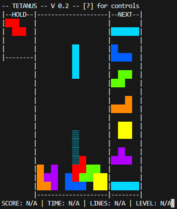

# its not tetris i swear

~~tetris~~ tetanus on the command line, in python

### dependencies
 - [pynput](https://pypi.org/project/pynput/)

### controls: 
 - w/up/x: rotate clockwise
 - a/left: move left
 - s/down: soft drop
 - d/right: move right
 - z/lctrl: rotate anticlockwise
 - c/shift: hold
 - space: hard drop
 - esc/f1: pause
 - del: exit

launch with first paramater matching the following regex to use black and white mode `/^0$|^[Ff]/`

### todo
in no particular order
 - [ ] pausing
 - [ ] game over
 - [ ] do SRS rotation properly https://tetris.fandom.com/wiki/SRS#Wall_Kicks
 - [ ] T-spins
 - [ ] line clears
 - [ ] score
 - [ ] levels
 - [ ] UI (timer, score display)
 - [ ] make code not bad
 - [ ] use different input system that doesn't see keypresses globably (probably kbhit.py)
 - [ ] fix block preview (it breaks if a block is under another)
 - [ ] help menu on `?`
 - [ ] actual command line options
 - [ ] option for box drawing characters
 - [ ] prevent black and white mode from sending colour escape codes setting the termninal to white
 - [ ] add option to use ASCII only
 - [ ] add options for various ways to clear the terminal screen for better compatability

---
### other people's code
(currently unused) [`kbhit.py`](kbhit.py) by Simon D. Levy https://simondlevy.academic.wlu.edu/software/